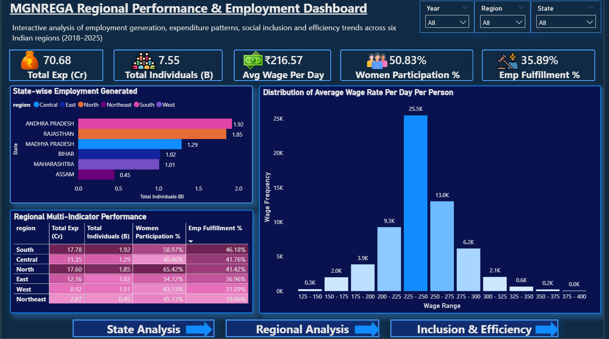
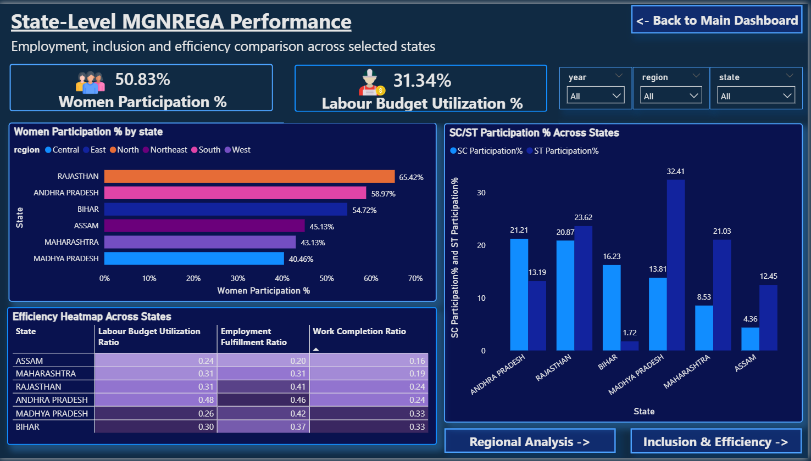
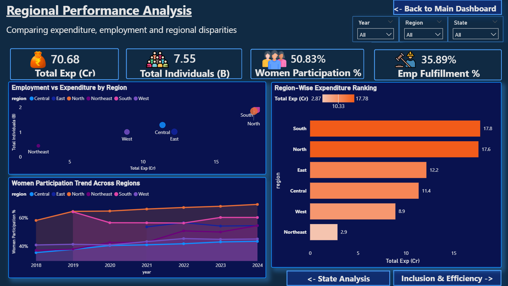
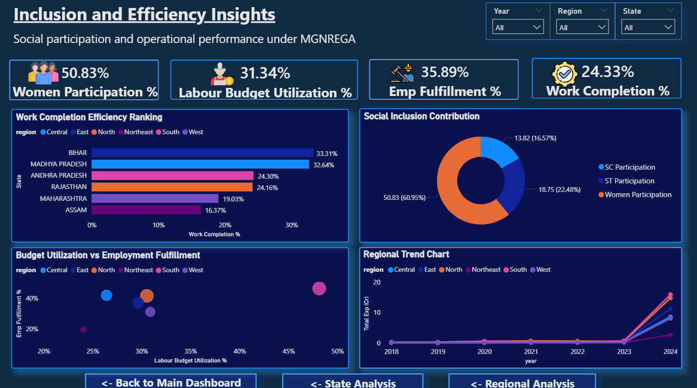

# Region-Wise Descriptive Analysis of MGNREGA in India (2018–2025)

## Project Overview

This project presents a comprehensive region-wise descriptive analysis of the Mahatma Gandhi National Rural Employment Guarantee Act (MGNREGA) across India from 2018 to 2025. The study evaluates employment generation, expenditure patterns, inclusiveness, administrative efficiency, and regional disparities using data preprocessing, feature engineering, exploratory data analysis (EDA), visualization, dashboard development, and statistical hypothesis testing.

The analysis focuses on six Indian states representing six geographical regions of India:

- Andhra Pradesh (South)
- Rajasthan (North)
- Bihar (East)
- Assam (North-East)
- Maharashtra (West)
- Madhya Pradesh (Central)

The project aims to transform raw administrative records into meaningful regional insights that highlight employment trends, financial allocation patterns, implementation efficiency, and socio-economic inclusion under MGNREGA.

---

## Problem Statement

Although MGNREGA operates under a common national framework, significant regional differences exist in:

- Employment generation
- Wage rates
- Labour budget allocation
- Expenditure efficiency
- Social inclusion
- Administrative performance

The COVID-19 pandemic significantly increased dependence on MGNREGA, but the magnitude and sustainability of its impact varied across regions. This project addresses the gap in structured long-term region-wise comparative analysis of employment and expenditure trends under MGNREGA.

---

## Objectives of the Study

The primary objective of this project is to conduct a region-wise comparative analysis of MGNREGA performance across selected Indian states from 2018–2025.

### Specific Objectives

### 1. Employment Generation Analysis

- Analyze households and individuals employed under MGNREGA
- Study persondays generated for Women, SC, ST, and Differently-abled workers
- Evaluate completion of 100 days of guaranteed employment
- Compare average employment days across regions

### 2. Financial Performance Evaluation

- Examine expenditure trends over time
- Analyze wage, material, and administrative expenditure
- Evaluate wage-to-material expenditure ratio
- Compare approved labour budget with actual expenditure

### 3. Inclusiveness & Social Equity Assessment

- Assess participation of:
  - Women
  - Scheduled Castes (SC)
  - Scheduled Tribes (ST)
  - Differently-abled workers
- Compute participation ratios for fair comparison across states

### 4. Administrative Efficiency Evaluation

- Analyze percentage of payments generated within 15 days
- Evaluate fund utilization efficiency
- Identify delays and implementation inefficiencies

### 5. Regional Comparison

- Compare performance indicators across six regions of India
- Identify high-performing and low-performing regions
- Study regional disparities and implementation patterns

### 6. Trend Analysis (2018–2025)

- Analyze year-wise trends in:
  - Employment generation
  - Wage rate
  - Expenditure
  - Budget utilization
- Study the impact of COVID-19 on rural employment demand

### 7. Feature Engineering

Derived indicators created during analysis include:

- Expenditure per household
- Wage share ratio
- Women participation ratio
- SC/ST participation percentage
- Employment fulfillment ratio
- Work completion efficiency
- Differently-abled participation ratio

---

## Dataset Details

### Dataset Source

The dataset is derived from official MGNREGA administrative records published by the Government of India.

Source:
https://www.data.gov.in/resource/district-wise-mgnrega-data-glance

### Dataset Characteristics

- Structured tabular dataset
- Monthly district-level administrative records
- Quantitative socio-economic indicators
- Time-series cross-sectional data

### Dataset Size

- Total Rows: 72,575
- Total Columns: 36
- Time Period: 2018–2025
- Coverage: Six Indian states across six regions
- Approximate Size: 20 MB

---

## Important Variables Used

Key variables analyzed in this project include:

- Total Expenditure
- Wages
- Material and Skilled Wages
- Administrative Expenditure
- Approved Labour Budget
- Total Individuals Worked
- Total Households Worked
- Households Completing 100 Days Employment
- Average Days of Employment per Household
- Women Persondays
- SC/ST Persondays
- Differently-abled Persons Worked
- Average Wage Rate per Day per Person
- Number of Completed Works
- Percentage Payments Generated Within 15 Days
- Agricultural & NRM Expenditure Percentages

---

## Technologies and Tools Used

### Programming & Analysis Tools

- Python
- Jupyter Notebook
- Power BI

### Python Libraries

- pandas
- numpy
- matplotlib
- seaborn
- scipy

---

## Project Workflow

The project follows a structured analytical framework.

### 1. Data Collection

- Collection of district-wise MGNREGA administrative records
- Validation and integration of datasets

### 2. Data Cleaning and Preprocessing

Preprocessing steps performed include:

- Null value analysis
- Zero value treatment
- Duplicate validation
- Data type standardization
- Logical range checks
- Outlier analysis
- Consistency verification

### 3. Feature Engineering

Custom indicators were developed for comparative regional analysis, including:

- Women participation ratio
- Wage share ratio
- Employment fulfillment ratio
- Expenditure efficiency indicators
- Work completion efficiency
- SC/ST participation percentages

### 4. Dataset Aggregation

Creation of:

- State-Year aggregated datasets
- Region-Year aggregated datasets

for multi-level analysis and visualization.

### 5. Exploratory Data Analysis (EDA)

EDA techniques used include:

- Summary statistics
- Distribution analysis
- Correlation analysis
- Trend analysis
- Comparative regional analysis

### 6. Visualization & Dashboard Development

Visualizations and dashboards were created using Python and Power BI.

Key visualizations include:

- Employment trend analysis
- Region-wise expenditure analysis
- Wage rate comparison
- Women participation analysis
- Correlation heatmaps
- Scatter plots
- Boxplots
- Trend analysis charts

An interactive Power BI dashboard was also developed for visual storytelling and KPI monitoring.

### 7. Statistical Hypothesis Testing

The project includes statistical validation using:

#### Independent Sample t-Test

- Pre-2020 vs Post-2020 employment comparison

#### Pearson Correlation Test

- Relationship between expenditure and employment generation

#### One-Way ANOVA

- Variation in women participation across states

---

## Key Insights from the Analysis

- Employment generation increased significantly after 2020, highlighting the role of MGNREGA during the COVID-19 period.
- Strong positive correlation exists between expenditure and employment generation.
- Significant regional disparities were observed in expenditure, employment, and implementation efficiency.
- South and North regions emerged as dominant performers in employment and expenditure.
- Northeast region showed comparatively lower participation and expenditure levels.
- Women participation varied significantly across states, indicating regional differences in inclusiveness.
- Higher expenditure did not always guarantee better efficiency or work completion.

---

## Project Structure

```text
mgnrega-data-analysis
│
├── data
│   ├── raw
│   │   └── original dataset
│   └── processed
│       └── cleaned and aggregated datasets
│
├── notebooks
│   ├── MGNREGA_Analysis.ipynb
│   ├── outlier_methods.ipynb
│
├── dashboard
│   └── MGNREGA_dashboard.pbix
│
├── outputs
│   ├── figures
│   ├── report
│
├── README.md
└── requirements.txt
```

---

## Key Analysis Performed

The project includes:

- Data preprocessing and cleaning
- Zero value treatment
- Missing value analysis
- Outlier analysis
- Feature engineering
- State-wise employment analysis
- Region-wise comparative analysis
- Wage trend analysis
- Expenditure analysis
- Inclusion and participation analysis
- Correlation analysis
- Hypothesis testing
- Dashboard development

---

## Expected Outcomes and Significance

This project aims to identify:

- Regions with consistent employment growth
- Budget allocation efficiency patterns
- Wage growth disparities
- Social inclusion effectiveness
- Impact of economic disruptions on rural employment
- Regional inequalities in MGNREGA implementation

The study contributes toward evidence-based evaluation of rural employment programs and policy effectiveness.

---

## Conclusion

This project presents a structured region-wise descriptive evaluation of MGNREGA using preprocessing, feature engineering, exploratory data analysis, visualization, dashboard development, and statistical testing.

The findings reveal strong relationships between expenditure and employment generation while also highlighting significant regional disparities in implementation, inclusiveness, and administrative efficiency. The analysis demonstrates the critical role of MGNREGA in rural livelihood generation and socio-economic support, particularly during crisis periods such as COVID-19.

Overall, the study provides meaningful insights into employment patterns, expenditure dynamics, and regional performance under MGNREGA across diverse socio-economic contexts in India.

---

## Power BI Dashboard







---

## Future Scope

Possible future extensions of this project include:

- Predictive modeling for employment forecasting
- Clustering states based on socio-economic indicators
- Machine learning-based trend prediction
- Advanced geospatial analysis
- Interactive web dashboard development
- Integration with additional rural development datasets

---

## Author

This project was developed as part of a data analysis study focusing on employment generation, socio-economic inclusion, and regional disparities under MGNREGA using data-driven analytical techniques.
